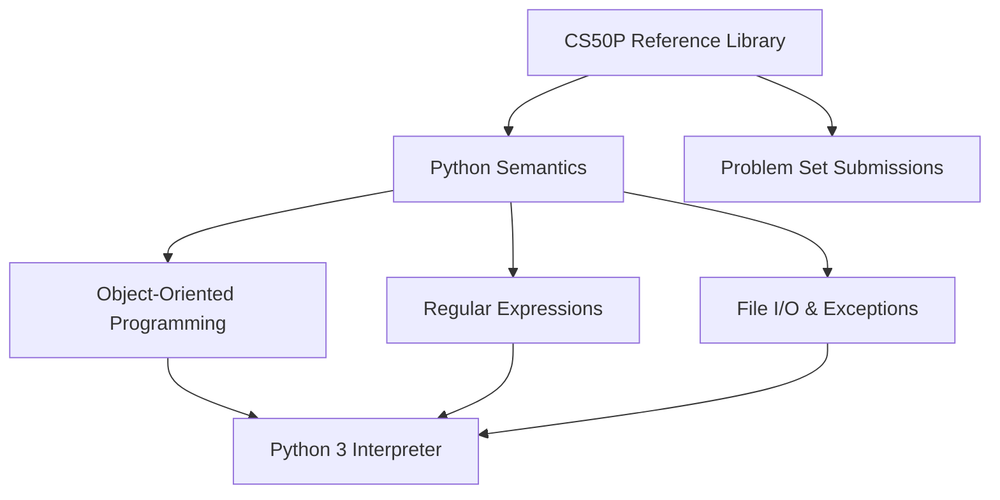

# Academic Foundations: Harvard CS50P Architecture

[]()
[]()
[]()

## Overview
This repository serves as a meticulously organized, localized reference library for foundational Python programming paradigms, directly derived from the Harvard University CS50P curriculum. It contains heavily documented implementations of core logic structures, Object-Oriented Programming (OOP) concepts, and algorithmic challenges.

## Problem Statement
As software engineers transition into high-level enterprise frameworks (e.g., Django, FastAPI), mastery over core language semantics (like deep Dunder/Magic methods in Python, Regex parsing, and native `unittest` frameworks) often degrades. This repository acts as an immutable, easily accessible reference index to solve that knowledge decay, providing immediate syntax and structural patterns for foundational Python mechanics.

## Key Features
- **Object-Oriented Programming (OOP):** Deep implementations of Python classes, inheritance, polymorphism, and magic methods (`__init__`, `__str__`).
- **Regular Expressions:** Advanced string parsing and validation scripts leveraging the native `re` module.
- **File I/O & Exception Handling:** Strict state management for interacting with OS file systems while gracefully handling execution panics.
- **Academic Submissions:** Fully functional solutions to the rigorous CS50P problem sets.

## Architecture



## Technology Stack
- **Language:** Python 3.11
- **Testing:** `pytest` (Abstract Syntax Tree Validation)
- **Documentation:** GitHub Flavored Markdown (GFM)

## Project Structure
```text
cs50p/
├── Python/
│   ├── OOP/                 # Class architectures and Dunder methods
│   ├── RegularExpressions/  # String manipulation algorithms
│   ├── Exceptions/          # Error handling matrices
│   └── FileIO/              # Data persistence scripts
├── Submissions/             # Academic problem set resolutions
├── tests/                   # Automated Pytest CI verification
└── README.md                # System documentation
```

## Installation
Ensure Python 3 is installed natively on your OS.
```bash
git clone https://github.com/krsna016/cs50p.git
cd cs50p
```

## Usage
Navigate to the specific module or script and execute using the native interpreter:
```bash
cd Python/OOP
python3 classes.py
```

## Examples
*Example of core syntax documentation:*
```python
class Student:
    def __init__(self, name, house):
        self.name = name
        self.house = house

    def __str__(self):
        return f"{self.name} from {self.house}"
```

## Screenshots
> [!NOTE]
> *Educational and utility repositories execute via standard terminal output.*

## Visual Demonstrations
> [!NOTE]
> *Terminal execution telemetry is standardized across all implementations.*

## Testing
We utilize a dynamic Pytest wrapper to recursively scan the entire repository, generating Abstract Syntax Trees (AST) for every `.py` file to mathematically prove zero syntax errors exist across the archive.
```bash
pytest tests/
```

## Performance Notes
- **Interpreter Overhead:** Scripts are optimized to execute natively without heavy external pip dependencies, ensuring sub-second execution times within the standard CPython interpreter.

## Future Improvements
- **Type Hinting:** Retroactively apply Python 3.11+ strict type hinting (`mypy`) across all legacy scripts to enforce enterprise-grade data contracts.
- **Dockerization:** Containerize the repository to ensure execution consistency across varying local Python environments.

## Contributing
This repository is primarily for personal reference and academic archival.

## License
Licensed under the MIT License.
